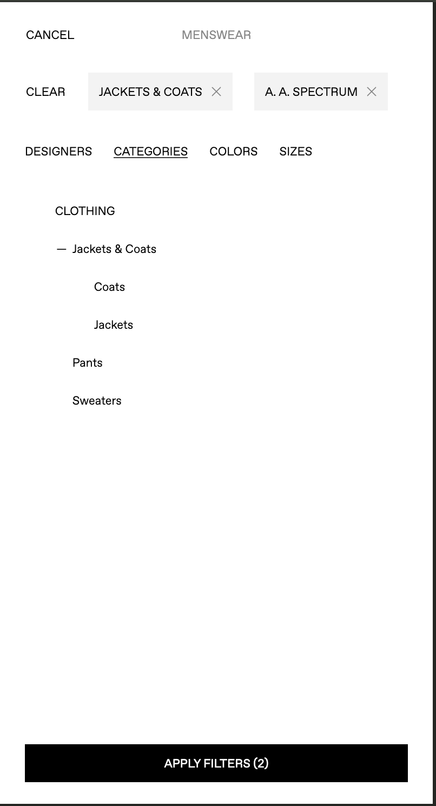
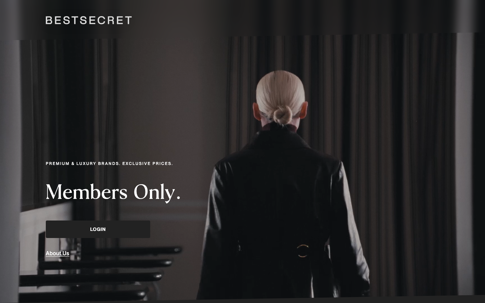
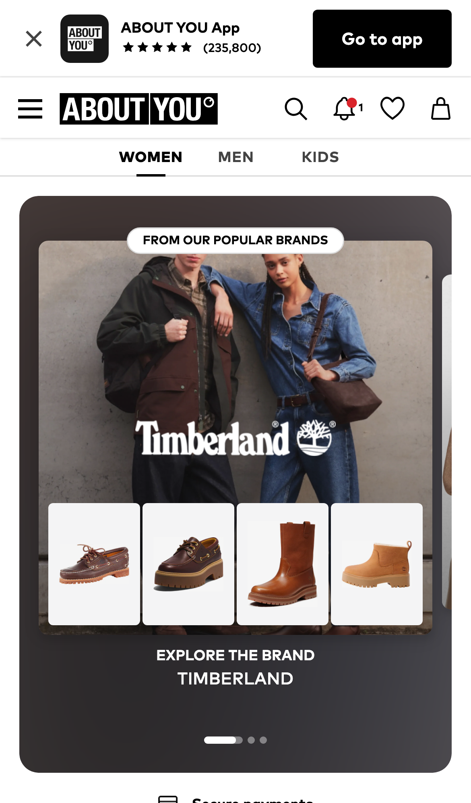

## Why this post

I'm preparing for a Product Manager role in the Luxe category at Nykaa. Nykaa Fashion launched LUXE on 3 September 2026, putting international luxury brands and Indian designer labels in one place, and I've applied for a product manager role on it.

These are my notes from that prep. I'm thinking out loud about what a luxury marketplace is for, and about what it takes to actually build one. This is not a finished point of view and it is not a pitch. I'll keep updating it as my prep goes.

## What's in here

- [The why](#the-why). There are plenty of e-commerce portals already, and plenty of luxury brands. So what is another luxury category for? The three approaches I think it takes: [simplicity](#simplicity-dogs-that-bark-dont-bite), [opinion](#opinion-speak-less-words-but-speak-great-words) and [exclusivity](#exclusivity).
- [The how](#the-how). Principles are one thing. This is what happens when they meet an existing product, an existing user base and a real market. It covers [who the user is](#who-the-user-is), and [a radical idea](#a-radical-idea-put-the-ugc-in-the-listing) about product images that comes out of thinking about them.
- [Where I've got to so far](#where-ive-got-to-so-far). The parts I haven't figured out.

## The why

There are so many e-commerce portals. There are so many luxury brands. So what is the point of yet another luxury category on an e-commerce platform? What exactly are we trying to do here? What is our role, what is the problem, and who is the customer?

Here is where I landed.

The key differentiator between a luxury brand and a luxury marketplace is this. When you're a brand, the customer wants your brand. But when you're a marketplace, you're a medium for the customer to get a brand they will prefer, or already prefer. So your role is to cater that process of purchase with the most premium experience.

Here's how you deliver that.

### Simplicity: dogs that bark don't bite

Dogs that bark don't bite. And dogs that bite don't need to bark. That's the thought here.

Take this [Polo Ralph Lauren backpack on SSENSE](https://www.ssense.com/en-in/men/product/polo-ralph-lauren/brown-pebbled-leather-backpack/19514441).

The website isn't fancy. It's plain, minimalistic and simple. It's focused on function over form, without compromising on a minimum threshold of the form. It's not ugly or boring. Nor is it trying to make a statement about itself. It's fully focused on helping the customer buy, and everything else is clutter and out of the picture. It understands that a premium profile customer has their own goal, and it doesn't get in the way of that at all. It respects the user's time, energy and attention.

That's what makes it a good product for the luxury category.

Here are the visible symptoms of this:

- All the pictures, across different brands, still have the same photography style. The number of photos, the angle the photos are taken at, and the sequence of photos are all consistent. Even the backgrounds are consistent.
- The description is extremely minimal. They've identified the most important things and covered only those, in a way that is easiest for the user to understand. There is always the features of the bag, the material, the location of manufacture and the product code. To address size, they've shown it in the picture and referenced the size of the model.
- The filters are dynamic. As you apply a filter for a category, you only see the sub-category filters that actually have products in them.

Here's the photography point. These are eight backpacks from eight different brands, all pulled off the same page:

*Every one of them is shot the same way, from the same angle and at the same size with the straps up, so the only thing that actually changes is the bag.*

This is the whole description for that Polo Ralph Lauren backpack, copied exactly as it appears:

> Pebble-grained leather backpack.
>
> · Fixed carry handle
> · Padded adjustable shoulder straps
> · Zip pocket and logo patch at face
> · Fixed strap at padded mesh back face
> · Two-way zip closure
> · Laptop compartment
> · Zip pocket at interior
> · Twill lining
> · H15.5" x W12.5" x D6"
>
> Supplier color: Dark Brown
>
> Leather.
> Made in India.
>
> 262213M166002

*It covers the features, the material, where it was made and the product code, and then it stops.*

And the filters:

*I've applied two filters here, a category and a designer. Under Clothing you only see what that designer actually has, so you can't click through to an empty page.*

### Opinion: speak less words, but speak great words

Look at the [SSENSE homepage](https://www.ssense.com/en-in).

You'd expect an e-commerce brand's homepage to be buttons, widgets, banners and what not. In all my experience of working at e-commerce companies, this is what a homepage looks like:

- There's search, for high intent users.
- There are buttons for navigation, for users who want structured exploration.
- There's a banner for trust or marketing, showing the authenticity of your brand, or some current top products and offers.

Now look at this website:

*Shop Menswear and Shop Womenswear are just text, they don't even look like buttons. Search is a small icon in the corner. And the first thing here with a picture is an interview about someone's photobook, with no product in it at all.*

- It has search, but it's tucked away in the corner. My guess is that either their buying users mostly land on product pages directly, or they're betting that a high intent user will find the search even in the corner, or they have seen that most visitors are exploratory users and so search doesn't need a big space up front. The point is that they didn't follow the run of the mill e-commerce homepage. They went with an opinionated decision.
- It has the banner (the thing that keeps changing its text) and the navigation buttons (the two big buy menswear and womenswear buttons). But they haven't tried to show these like buttons. It's just a piece of text on a screen, not really a button in UX terms, even though it is one in code terms.

And why is that so? This is why.

They've dedicated the majority of their homepage, and the majority of the first scroll, to look like a blog. There are posts after posts in a classic blog format.

Why specifically a blog format? Because when you're a luxury marketplace with primarily exploratory users coming to your platform, the users aren't coming to buy commoditised products, the way you'd buy a detergent on Zepto. The users are buying a story, an experience, a statement that the brand makes. And that's why the blog format, the most time tested format for sharing your own personal opinion.

- Each blog post has an image that speaks about the creator's style. They didn't standardise the images here.
- Each blog post has a title and a small description, a space for the creators to showcase their persona.
- The blog posts don't focus on a product. They focus on the brand's story and its identity, because in luxury purchases that's what users connect with first. The product comes along after.

### Exclusivity

Try seeing [bestsecret.com](https://www.bestsecret.com). You won't be able to.

*That's the whole homepage. You get a login button and that's it.*

It's a member only website, and you can only join through invite links.

Normally, whenever I hear of a "member only" platform, I put an asterisk in my head on the claim. I expect it to be a new platform hyping itself up to seem exclusive, when it's only a few days, or at best a few months, away from becoming a mass-market, please come and buy from me as much as you can platform.

I mean, even I've launched products that were functionally in beta mode but wrapped in an "exclusivity" tag to make them feel premium.

Not BestSecret though. I can find comments as far back as six years ago where people are asking for invite codes. And surprisingly, there is very little to no negative feedback at all. I'm not saying their visitor to order conversion is 100%, or that their NPS is 100. But even the "bad" comments I found were not bad. They just said there was a better platform for a specific use case, like buying something with faster delivery, or a specific selection, or availability of stock. Nowhere did I find users saying "scammers" or "fake products".

Going exclusive allows for doing the BAU better.

I'm still piecing together how this strategy can come through for a platform like Nykaa, which does have shareholders to answer to, and would perhaps want to maximise revenue for its Luxe category.

## The how

Your core principles are one thing. When the rubber hits the road, you are faced with the realities of the existing product, the existing user base, your target audience, the kind of market you are in and the kind of selection you have. You need a vision of where you want to go, based on your principles. You also need a path to reach there, and you need to know what needs to be done immediately next to move towards that vision.

So, how do you carve out Luxe given the utilitarian nature of an e-commerce platform that belongs to a mass market brand in India?

In simpler terms: Nykaa is already a known mass market e-commerce brand, with an identity, an existing user base, and a product built around the two. How do you then carve out a space within the Nykaa umbrella for a Luxe category? What's the end vision, and how do you get there?

Here's one example of something that has found a good balance, the [celebrity collections on ABOUT YOU](https://www.aboutyou.com/s/celebrity-collections-7779).

*The widget is doing two jobs at once. The campaign image gives the brand its space, and the four tiles underneath are the SKU space, while the usual ABOUT YOU navigation still sits above all of it.*

Here's why I say so:

- The homepage hero element is a carousel banner, with a background repurposed to make a brand identity come through.
- The content of the descriptions is concise, but there's also more content available if you'd like to read it.
- The brands get their own dedicated pages to talk about themselves, their own storefronts.

### Who the user is

Another thing to consider here is the target audience. More and more, it's going to be Gen Z. So who are they, and how do they experience luxury?

Gen Z are digital natives, so familiarity with an interface is not a problem for them. They didn't grow up on western influence as much as we did. They grew up on Indian stories and the Indian dream, so the content needs to reflect that too. They value trust and authenticity over anything else, so the brand and the product's lore needs to come out to justify the purchase. They're interested in the outcome as much as they're interested in the experience of getting to the outcome.

### A radical idea: put the UGC in the listing

A fashion brand's biggest asset is the free, high quality pictures that consumers put in their reviews. Women go out of their way to post pictures of their hair after a good wash using an Olaplex shampoo.

And yet, Olaplex's product listing has five pictures of the shampoo bottle with some boring content, and a fifth picture of an international model that absolutely goes invisible to an eye that can't relate to it.

So here's the radical idea: use the UGC in the product listing itself.

Someone told me Myntra already does this.

## Where I've got to so far

This is still an exploration. So far I've only figured out two parts of it, the why and the how.

What I want to go deeper on next is defining, very specifically, what the product would actually look like for Nykaa Luxe. Not only the product, but the overall user journey as well, and how that would look.

This post is a work in progress, and there may be updates depending on how my prep goes and how my interviews go.
